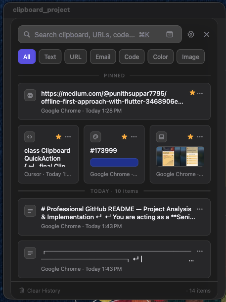
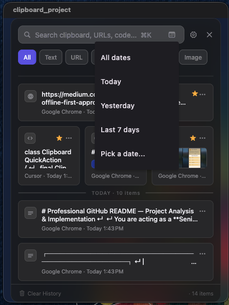
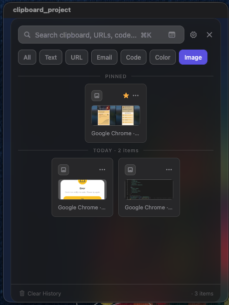
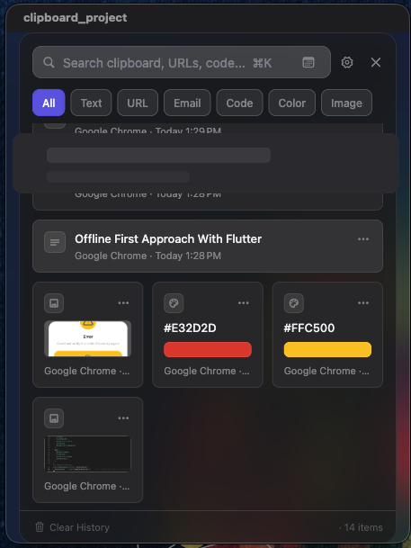
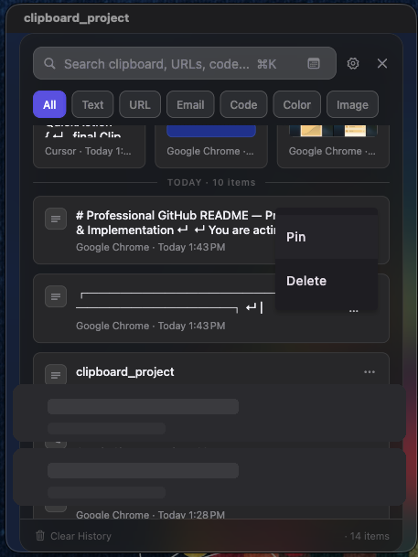

# Clipboard Manager

A macOS menu bar clipboard history app built with Flutter. Browse, search, filter, and re-copy recent text and images from a floating panel — opened with **⌘⇧V**.

<p align="center">
  
</p>

> **Platform:** macOS only (native integration). Other Flutter platform folders are scaffold and are not part of the supported product surface.

---

## Overview

Clipboard Manager runs in the macOS menu bar and watches the system clipboard in the background. Copied content is classified, deduplicated, and stored locally in SQLite. When you need something again, open the panel, find it, and paste it back with one click or Enter.

The app is designed as a lightweight utility: no account, no cloud sync, and no network dependency for core functionality.

---

## Features

### Clipboard & history

- Automatic monitoring of text and image clipboard changes
- Local history stored in SQLite (Drift)
- Duplicate detection via SHA-256 content hashing
- History limit of 1,000 items (pinned items are kept)
- Copy an item back to the clipboard and hide the panel
- Image support (PNG/TIFF captured and cached locally)
- Source app name recorded when available

### Search & filters

- Debounced text search across stored content
- Date filters: Today, Yesterday, Last 7 days, or a specific day
- Category filters: Text, URL, Email, Code, Color, Image

### Organization

- Pin favorites to a dedicated section at the top
- Recent items grouped by day
- Delete items or clear all history from the panel footer
- Context menu for pin/unpin and delete

### Content-aware UI

- Automatic type detection: image, URL, email, phone, color (hex / `rgb()`), code, plain text
- Quick actions where applicable:
  - **URL** — Open, Copy
  - **Email** — Email, Copy
  - **Phone / Code** — Copy
- Color and image items use a grid layout with visual previews

### macOS integration

- Menu bar app (no Dock icon) with tray menu
- Global shortcut **⌘⇧V** to toggle the panel
- Floating glass panel window
- Launch at login (Settings)
- Pause or resume clipboard monitoring from the menu bar
- Accessibility permission support for enhanced global shortcut handling

### Keyboard shortcuts (panel)

| Key | Action |
| --- | ------ |
| **⌘⇧V** | Toggle panel (system-wide) |
| **↑ / ↓** | Move selection |
| **Enter** | Copy selected item and hide panel |
| **Esc** | Close panel or exit Settings |

---

## Screenshots

<p align="center">
  
  <br><em>Pinned section, category chips, and history grouped by day</em>
</p>

<table>
  <tr>
    <td align="center" width="50%">
      <br>
      <sub>Date filtering</sub>
    </td>
    <td align="center" width="50%">
      <br>
      <sub>Image category filter</sub>
    </td>
  </tr>
  <tr>
    <td align="center" width="50%">
      <br>
      <sub>Content-aware layouts (color swatches, image previews)</sub>
    </td>
    <td align="center" width="50%">
      <br>
      <sub>Pin / delete from the item menu</sub>
    </td>
  </tr>
</table>

---

## Tech Stack

| Technology | Purpose |
| ---------- | ------- |
| Flutter / Dart | Cross-platform UI (macOS target) |
| flutter_bloc | Application state management |
| Drift + SQLite | Local clipboard history storage |
| crypto | SHA-256 content hashing |
| url_launcher | Open URLs and mailto links |
| flutter_acrylic | macOS translucent window effect |
| Swift (macOS Runner) | Clipboard monitor, shortcuts, menu bar, launch at login |

---

## Architecture

The project uses a **feature-based** layout with **data / domain / presentation** layers under `lib/features/clipboard/`:

- **Domain** — entities, repository contracts, content detection, use cases, quick-action resolution
- **Data** — Drift-backed `ClipboardRepositoryImpl`
- **Presentation** — `ClipboardBloc`, UI mappers, and the modern glass-panel widgets
- **Core** — database setup and a `ClipboardPlatform` abstraction over Flutter method/event channels
- **Native (macOS)** — Swift handlers for clipboard monitoring, global shortcuts, status bar, and login items

Dependencies are wired manually in `lib/main.dart` using `RepositoryProvider` and `BlocProvider`.

---

## Project Structure

```text
lib/
├── main.dart
├── core/
│   ├── database/              # Drift schema
│   └── platform/              # Native bridge
└── features/clipboard/
    ├── data/
    ├── domain/
    └── presentation/

macos/Runner/
├── AppDelegate.swift
├── ClipboardMonitor.swift
├── GlobalShortcut.swift
├── LaunchAtLogin.swift
├── MainFlutterWindow.swift
└── StatusBarController.swift

test/features/clipboard/       # Unit, bloc, and widget tests
```

---

## Requirements

- **macOS 13.0+**
- **Flutter** SDK compatible with Dart `^3.13.0` (see `pubspec.yaml`)
- **Xcode** (for macOS builds)

No environment variables, API keys, or external services are required.

---

## Getting Started

```bash
git clone <repository-url>
cd clipboard_project
flutter pub get
```

Drift code generation output (`database.g.dart`) is already committed. Regenerate only after schema changes:

```bash
dart run build_runner build --delete-conflicting-outputs
```

---

## Running

```bash
flutter run -d macos
```

The app starts in the menu bar. Press **⌘⇧V** or choose **Open Clipboard History** from the tray menu.

---

## Building

```bash
# Release build
flutter build macos --release
```

Output:

```text
build/macos/Build/Products/Release/clipboard_project.app
```

Debug and profile builds use App Sandbox entitlements. Release builds use `macos/Runner/Release.entitlements` (sandbox disabled).

---

## Testing

```bash
flutter test
flutter analyze
```

The test suite covers date filters, content detection, repository queries, BLoC behavior, UI mapping, and the modern panel page.

---

## Development

| Task | Command |
| ---- | ------- |
| Install dependencies | `flutter pub get` |
| Run on macOS | `flutter run -d macos` |
| Release build | `flutter build macos --release` |
| Run tests | `flutter test` |
| Static analysis | `flutter analyze` |
| Regenerate Drift code | `dart run build_runner build --delete-conflicting-outputs` |

Lint rules are defined in [`analysis_options.yaml`](analysis_options.yaml) (extends `flutter_lints`).

---

## macOS Notes

### Permissions

- **Accessibility** — Optional but recommended for reliable system-wide shortcut handling. Enable the exact `.app` bundle you are running in **System Settings → Privacy & Security → Accessibility**. The in-app Settings screen shows the current bundle path and shortcut status.
- **Launch at login** — Managed via `SMAppService`; macOS may prompt when enabling.

### Debug vs release

Debug and release builds produce **different app bundles** at different paths. Accessibility permissions are tied to the specific binary. After switching build modes or rebuilding, you may need to remove old entries and re-add the new `.app` in Accessibility settings.

### Global shortcut

The native layer registers **⌘⇧V** using:

1. Carbon `RegisterEventHotKey` (works without Accessibility)
2. CGEvent tap when Accessibility is granted
3. `NSEvent` global monitor as a fallback

### Menu bar behavior

- Closing the panel hides the window; the app keeps running.
- Quit from the tray menu to exit completely.

---

## Release

The repository documents local builds only:

```bash
flutter build macos --release
open build/macos/Build/Products/Release/clipboard_project.app
```

There are no CI/CD workflows, notarization scripts, or distribution guides in the repository.

---

## License

No `LICENSE` file is present in this repository. Add one before distributing or accepting contributions.

---

## Related Documentation

- [`README_PLAN.md`](README_PLAN.md) — Repository audit and README planning notes used to produce this file.
